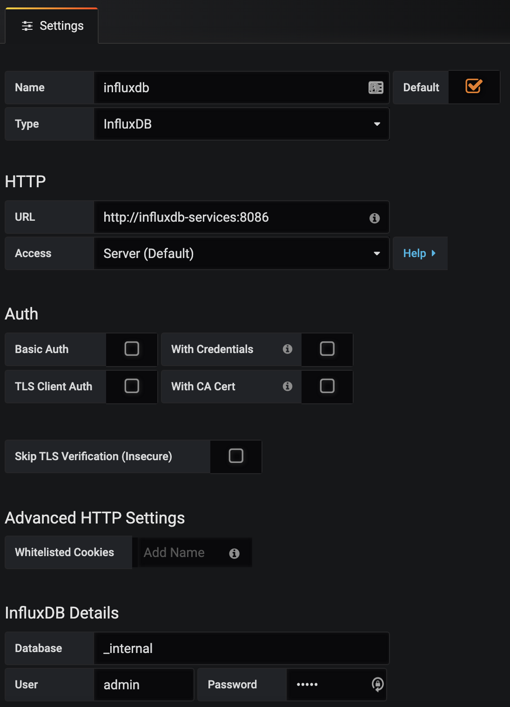

Trivago Metasearch
---
_...Trivago Metasearch webservers 🚀..._

### Preconditions
Install the following software:
- [terraform ](https://www.terraform.io/)
- [minikube](https://kubernetes.io/docs/tasks/tools/install-minikube/)
- [virtualbox](https://www.virtualbox.org/wiki/Downloads)
- [docker](https://docs.docker.com/get-docker/)
- [ab](https://httpd.apache.org/docs/2.4/programs/ab.html)

**Important:**
The default user and password for Grafana, influxDB, Prometheus, Telegraf is admin/admin

### Test Build Images and RUN
Download the Trivago.zip file.
Java Webserver version:
``` bash
$ cd Trivago/webserver-java
$ docker build -t adecchi/java-webserver:1.0 .
$ docker run -it -p 8080:8080 adecchi/java-webserver:1.0
$ curl -X GET http://localhost:8080/
```
Golang Webserver version:
``` bash
$ cd Trivago/webserver-go
$ docker build -t adecchi/golang-webserver:1.0 .
$ docker run -it -p 8081:8080 adecchi/golang-webserver:1.0
$ curl -X GET http://localhost:8081/
```

### WEBSERVERS SETUP
Download the Trivago.zip file. 
Execute the following commands to build the Java image inside minikube.
``` bash
$ cd Trivago/webserver-java
$ eval $(minikube docker-env)
$ docker build -t adecchi/java-webserver:1.0 .
```
Execute the following commands to build the Golang image inside minikube.
``` bash
$ cd Trivago/webserver-go
$ eval $(minikube docker-env)
$ docker build -t adecchi/golang-webserver:1.0 .
$ docker run -it -p 8080:8080 adecchi/golang-webserver:1.0
```
Enable the Nginx Ingress.
``` bash
$ minikube addons enable ingress
```
Enable the Metrics Server.
``` bash
$ minikube addons enable metrics-server
```
Configure the k8s cluster using Terraform, it can take near 5 min estimated.
Terraform will use the context minikube configured in `~/.kube/config`
``` bash
$ cd Trivago/terraform
$ terraform init
$ terraform plan
$ terraform apply
```
If you get an error please re-run it. The following error are expected, but you can continue. The error is due the LB
integration with minikube.
``` text
Error: Waiting for service "monitoring/grafana-services" to assign IP/hostname for a load balancer
```
Check that all PODs are running, if not please re-run terraform
``` bash
$ kubectl get pods -A
```
Test Java and Golang webserver version, each command will return the url to connect.
``` bash
$ minikube service trivago-java-services -n trivago --url 
$ minikube service trivago-golang-services -n trivago --url 
```
Append the host endpoint entry to `/etc/hosts`
``` bash
$ sudo echo $(minikube ip) canary-demo.trivago.com >> /etc/hosts
```
Test Canary URL endpoint.
``` bash
$ curl -X GET http://canary-demo.trivago.com/
```
If you want to destroy the K8S cluster, please run.
``` bash
$ cd Trivago/terraform
$ terraform destroy
```

### PROMETHEUS SETUP:
Get the prometheus endpoint running the following command.
``` bash
$ minikube service prometheus-services -n moni
```

### GRAFANA SETUP:
Get the grafana endpoint running the following command.
``` bash
$ minikube service grafana-services -n monitoring --url
```
Configure InfluxDB datasource like this:


Configure Prometheus datasource like this:


Go to (+) icon, select "import" and in "Grafana.com Dashboard" paste the following link, to import K8S cluster Dashboard.
Please remember to import into the "Prometheus data source."
``` text
https://grafana.com/grafana/dashboards/10856
```

Go to (+) icon, select "import" and in "Grafana.com Dashboard" paste the following link, to import Nginx Ingress Dashboard.
Please remember to import into the "Prometheus data source."
``` text
https://grafana.com/grafana/dashboards/9614
```

### LOAD TEST:
Using Apache Benchmark (ab):
``` bash
$ ab -n 1000 -c 100 -s 60 -m GET http://canary-demo.trivago.com/
```

Using curl command:
``` bash
$ while true;do curl -X GET http://canary-demo.trivago.com/;done
```

### Commands to Debugs
minikube
``` bash
$ minikube stop
$ minikube start
$ minikube status
$ minikube ssh
$ minikube service list
$ minikube addons list | grep enabled
```

K8S
``` bash
$ kubectl get pods -A
$ kubectl get services -A
$ kubectl get ingress -A
$ kubectl get deployments -A
$ kubectl config set-context --current --namespace=NAMESPACE_NAME
$ kubectl describe pod POD_NAME -n NAMESPACE_NAME
$ kubectl describe service SERVICE_NAME -n NAMESPACE_NAME
$ kubectl describe ingress INGRESS_NAME -n NAMESPACE_NAME
$ kubectl describe deployment DEPLOYMENT_NAME -n NAMESPACE_NAME
$ kubectl logs POD_NAME -n NAMESPACE_NAME
$ kubectl exec --stdin --tty POD_NAME -- /bin/sh
```

### Why I choose what I choose ?

##### terraform:
Because, it is an standard in IaC, it has a long community. Many people contribute writing code, modules, libraries.
On the other hand, is very fast, maintain the state of the infrastructure, can work in a CI/CD, support many provider,
low curve to learn.
In this example, I use to create the K8S using minikube, but we can adapt to run in Google Cloud, Amazon AWS, Azure an others.
We can create monitors, dashboard, alert in Datadog, NewRelic and other providers while we are creating the K8S cluster.
##### minikube:
I was a long time using minikube as there is simply alternatives and to be honest it does a pretty good job at being a 
local Kubernetes for development environment. You can create the cluster, wait a few minutes and you are ready to go. 
Here my comparison table:

| feature | minikube | kind | k3s |
| ------ | ------ | ------ | ------ |
| runtime | VM | CONTAINER | NATIVE |
| architectures | AMD64| AMD64 | AMD64, ARMv7, ARM64 |
| container runtimes | Docker, CRI-O, Containerd, Gvisor | Docker | Docker, Containerd |
| startup time initial/following | 5:19 | 2:48 / 1:06 | 0:15 / 0:15 |
| memory requirements | 2GB | 8GB | 512MB |
| requires root? | NO | NO | YES |
| multi-cluster support | YES | YES | NO |
| multi-node support | NO | YES | YES |
| project page | [minikube](https://minikube.sigs.k8s.io/) | [kind](https://kind.sigs.k8s.io/) | [k3s](https://k3s.io/) |

##### prometheus:
Because it is the industry Standard and supports multidimensional data collection and data queuing.
Prometheus is reliable, allowing to quickly diagnose problems. Since each server is independent, it can be leaned on when 
other infrastructure is damaged, without requiring additional infrastructure.
Prometheus:
- Features a customizable toolkit, and delivers metrics without creating lag time on performance.
- Cloud-native applications and infrastructure such as Kubernetes. 
- Keep tabs on hundreds of microservices .
- Only alerts on critical responses such as production issues, incident response, post- mortem analysis, and metrics.
- Features a Node Exporter that can be customized to fetch data from any clients.
- Can be integrated with Grafana to show Dashboards.

##### grafana:
Is open source visualization and analytics software. It allows you to query, visualize, alert on, and explore 
your metrics no matter where they are stored.
It provides you with tools to turn your time-series database data into beautiful graphs and visualizations.
Easy to integrate with Prometheus and create your Dashboards.

##### docker:
It is the de facto Standard to build and share containerized applications and supported for many providers and container orchestrators.
It provides:
- Security
- Isolation
- Reproducible Image
- Easy CD/CI

### Pending Improvements
- Improve liveness and readiness probes.
- Create automation script to deploy all the requirements and application.
- Create test cases.
- Improve documentation. 
- Improve monitoring, dashboards and alerts.
- Create some CI/CD using GitHub, GitLab.
- Create/migrate the actual Terraform code to Modules.
- Create an option to deploy with `kubectl` in place of use Terraform.